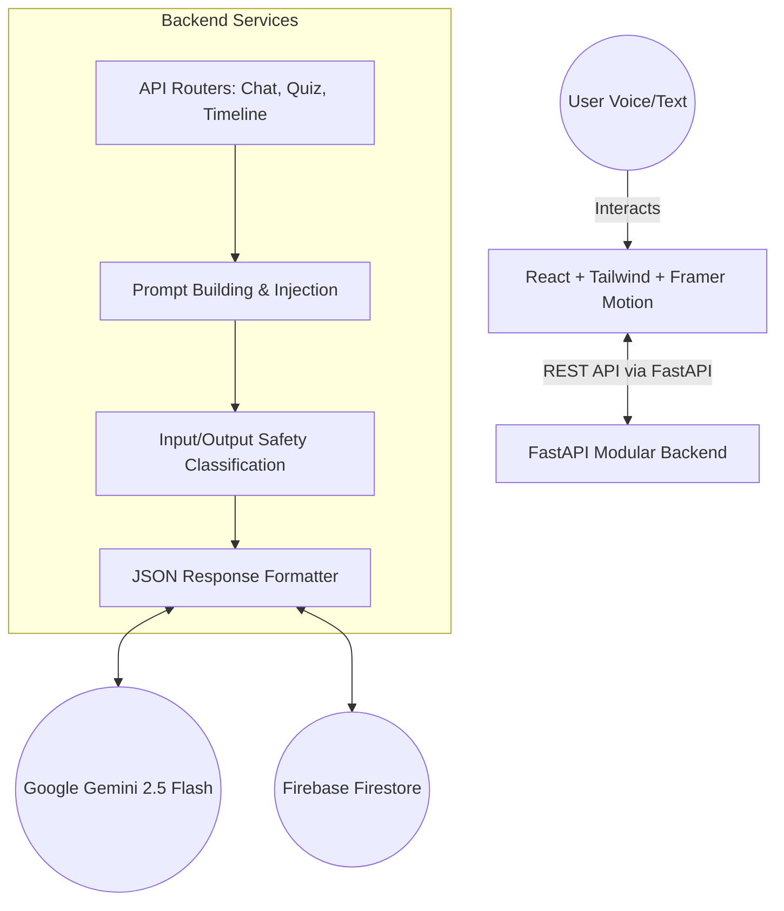
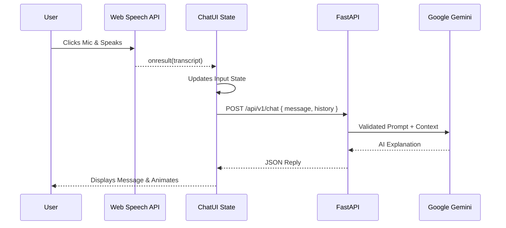
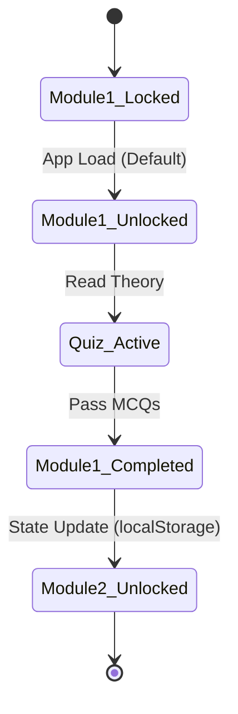

# Elector - AI-Powered Civic Education Platform

**Elector** is a production-grade, highly scalable AI platform designed specifically to educate Indian citizens about the democratic process. By leveraging the advanced reasoning capabilities of **Google Gemini 2.5 Flash**, the platform delivers a deeply engaging, responsive, and adaptive educational experience. 

From providing instantaneous, safe, and fact-checked guidance via a voice-enabled AI Chat, to presenting dynamic, progression-based interactive curriculum modules, Elector bridges the gap between complex constitutional mechanisms and everyday voters.

## 🌟 Core Modules & Capabilities

- **Elector AI Chat (Global Widget & Dedicated Screen):** A robust conversational agent with strict safety guardrails and deep context memory. It features seamless **Web Speech API integration** allowing users to dictate questions hands-free.
- **Structured Learning Curriculum:** A gamified, step-by-step module system (from "Introduction to Elections" to "Results Formation"). Features state-persistent unlocking mechanisms and integrated knowledge checks.
- **Adaptive Mini-Quizzes:** Dynamically generated MCQs embedded throughout the learning modules, complete with instant visual feedback and score tracking.
- **Interactive Election Timeline:** A beautiful carousel-based timeline highlighting key electoral events, capable of utilizing AI to fetch deeper explanations for each timeline step.
- **Resilient Offline Architecture:** Complete frontend gracefully degrades to comprehensive fallback data if the backend is temporarily unreachable, guaranteeing uninterrupted learning.
- **Modern UI/UX:** Built with React, Tailwind CSS v4, and Framer Motion for sleek micro-animations, glassmorphism, gradient text, and full Dark Mode support.

---

## 🏗️ System Architecture

### 1. High-Level Modular Design
The project separates concerns cleanly between a fast, reactive frontend and a secure, AI-orchestrating backend.



### 2. Voice-Powered AI Chat Sequence
The Elector AI chat utilizes browser-native speech recognition perfectly synchronized with React's state management to prevent closure staleness and ensure robust error handling.



### 3. Curriculum & Progression State Flow
The learning engine prevents skipping ahead, ensuring users fully understand foundational concepts before proceeding.



---

### 📂 Directory Architecture
- **Backend (`/backend/app`)**:
    - `core/`: Settings, Logging configurations
    - `api/`: REST Controllers
    - `services/`: Business Logic (`ai/` prompt & safety, `data/` database logic)
    - `models/`: Strict Pydantic schemas for data validation
- **Frontend (`/frontend/src`)**:
    - `components/`: Reusable UI (`ChatWidget.tsx`, `learning/ModuleCard.tsx`)
    - `context/`: `ThemeContext` for global Dark Mode handling
    - `pages/`: Primary views (`Learn.tsx`, `Chat.tsx`, `Timeline.tsx`)

## 🛠️ Setup & Local Development

### 1. Backend
```bash
cd backend
python -m venv venv
.\venv\Scripts\activate
pip install -r requirements.txt
# Set GEMINI_API_KEY and FIREBASE_CREDENTIALS_PATH in .env
uvicorn app.main:app --reload --host 0.0.0.0 --port 8000
```

### 2. Frontend
```bash
cd frontend
npm install
npm run dev
```

## 📦 Deployment
The project is ready for **Google Cloud Run** using the optimized Dockerfile.

```bash
docker build -t gcr.io/[PROJECT_ID]/elector .
docker push gcr.io/[PROJECT_ID]/elector
gcloud run deploy elector --image gcr.io/[PROJECT_ID]/elector --platform managed
```

---
*Developed for PromptWars - Optimizing for Excellence.*
