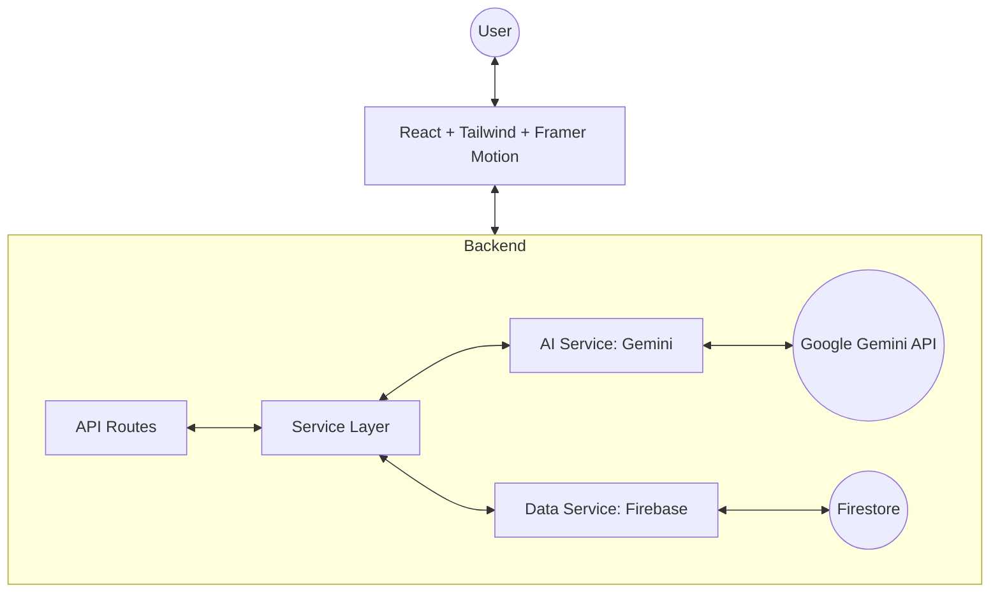

# Elector - AI-Powered Civic Education Platform

Elector is a production-grade, scalable AI platform designed to educate Indian citizens about the democratic process. Powered by **Google Gemini 2.5 Flash**, it provides a structured, safe, and engaging learning experience.

## 🏗️ Architecture



### 📂 Modular Structure
- **Backend (`/backend/app`)**:
    - `core/`: Config, Logging, Middleware
    - `api/`: REST Controllers (Chat, Quiz, Timeline)
    - `services/`: Business Logic
        - `ai/`: Prompt building, safety guards, response formatting
        - `data/`: Firebase/Firestore integration
    - `models/`: Pydantic validation schemas
- **Frontend (`/frontend`)**:
    - `context/`: Theme & Global State
    - `pages/`: UI Views (Chat, Timeline, Dashboard, Quiz)

## 🚀 Features
- **Elector AI Assistant**: Expert guidance with context memory and safety classification.
- **Adaptive Quiz Engine**: Dynamically generated MCQs based on difficulty and topic.
- **AI Timeline Intelligence**: Explains election steps in-depth using AI.
- **Learning Dashboard**: Track your mastery and recent activity.
- **Dark Mode & Smooth UI**: Modern SaaS-level experience with Framer Motion animations.
- **Voice Support**: Integrated Web Speech API for hands-free queries.

## 🛠️ Setup & Local Development

### 1. Backend
```bash
cd backend
python -m venv venv
.\venv\Scripts\activate
pip install -r requirements.txt
# Set GEMINI_API_KEY and FIREBASE_CREDENTIALS_PATH in .env
uvicorn app.main:app --reload --host 0.0.0.0 --port 8000
```

### 2. Frontend
```bash
cd frontend
npm install
npm run dev
```

## 📦 Deployment
The project is ready for **Google Cloud Run** using the optimized Dockerfile.

```bash
docker build -t gcr.io/[PROJECT_ID]/elector .
docker push gcr.io/[PROJECT_ID]/elector
gcloud run deploy elector --image gcr.io/[PROJECT_ID]/elector --platform managed
```

---
*Developed for PromptWars - Optimizing for Excellence.*
